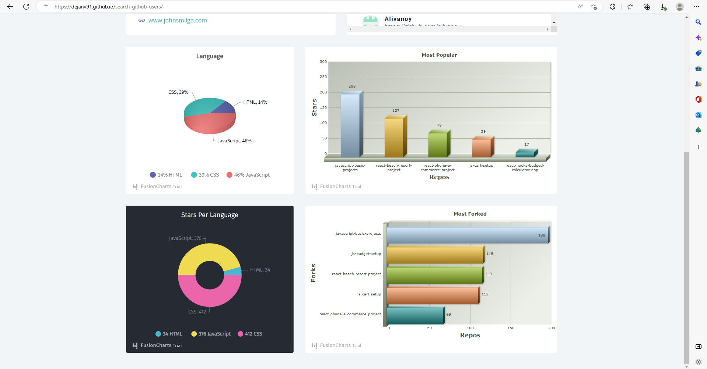

# Search Github Users

"Search Github Users" is an application that allows users to search for other GitHub users by username and view their profiles and repositories.

## Table Of Contents 📖

- [Search Github Users](#Search Github Users)
  - [Table Of Contents 📖](#table-of-contents-)
  - [Overview 🎯](#overview-)
    - [Screenshots 🖼️](#screenshots-️)
    - [Links 📌](#links-)
  - [Your Process 📝](#your-process-)
    - [Built with 🛠️](#built-with-️)
    - [What you Learned 🗒️](#what-you-learned-️)

## Overview 🎯

"Search Github Users" is a web application that allows users to search for other GitHub users and view their profiles, repositories, and statistics. It shows the most used programming languages, the projects with the most stars, etc. The goal of the project was to work with charts and learn authentication.

### Screenshots 🖼️

### Links 📌

Demo: **[Search Github Users](https://dejanv91.github.io/search-github-users)**

## Tools and goal 📝

### Built with 🛠️

#### Frameworks:

- JavaScript: **React.js**

#### Stack:

- Language: **HTML5**, **CSS3**, **JavaScript**

#### Package Manager:

- _npm_

### What you Learned 🗒️

I learned about authentication using the auth0 platform and used the FusionCharts library to display charts.
